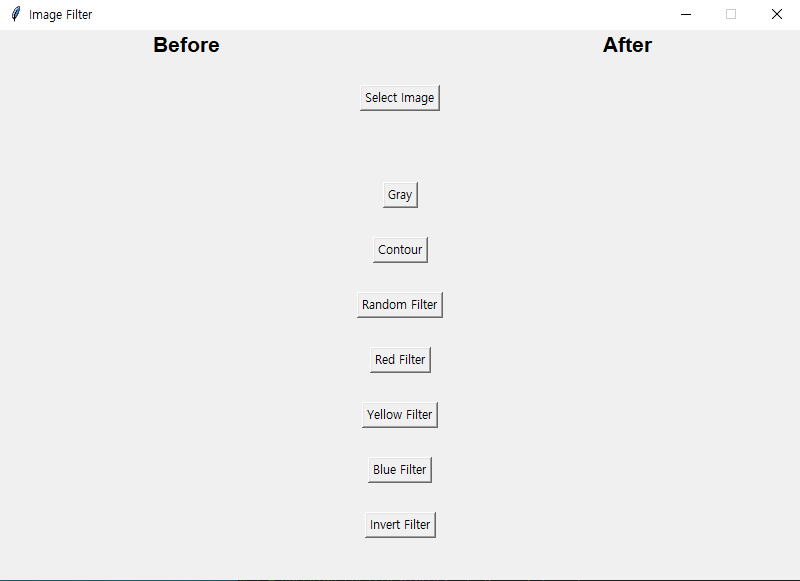

# Guide
---
#### **Requirements**
For building and running Image Display Convertor you need:
- OpenCV
- tkinter
- PIL
- numpy

#### **Installation**
```
$ python -m pip install opencv-python
$ pip install tk
$ pip install pillow
$ pip install numpy
```

---
#### **How to use?**

- Use "Select Image" button to load image from your system
- Click any filter you want to apply